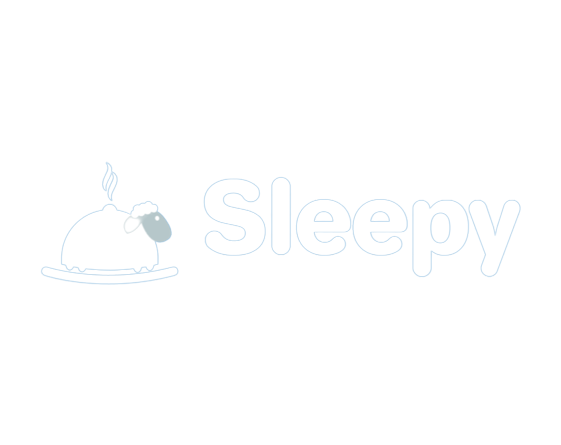

# Ecommerce "Sleepy" - Coderhouse



This is my final project for Coderhose React course. My very first ecommerce. Sleepy now will be your favourite sleephouse. Here you can find the perfect bed. Smushy as clouds solid as rocks. Long nights of sweet dreams are guaranteed so you'll get recovered after long working days. 

## Libraries 

- [React Router Dom](https://reactrouter.com/en/main)
- [Firebase](https://firebase.google.com/?hl=es)
- [React Router Dom](https://reactrouter.com/en/main)

## Steps to build the project locally 

```
git clone https://github.com/guidobtg97/coder-clase-1-Battigelli.git
```

`npm install`

`npm start`